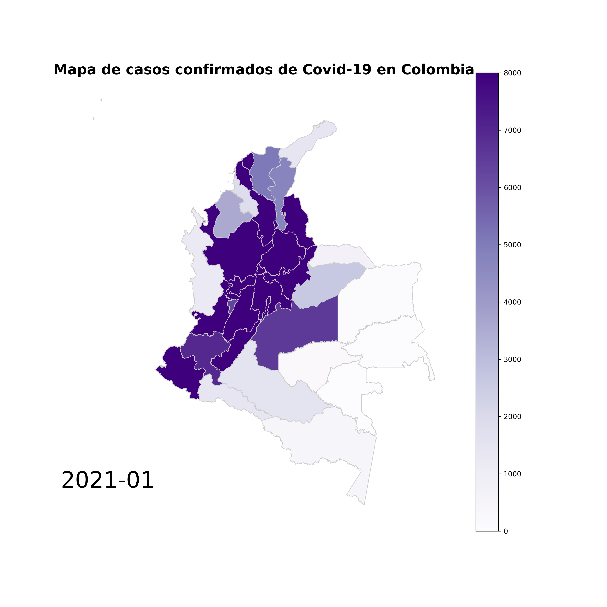

# COVID-19 Evolution Map in Colombia

The following code is used to make a gif-map about evolution of COVID-19 cases in Colombia.

The project is divided as follows and you can see it in this [Jupyter Notebook](https://github.com/jjuan97/Covid-evolution-map-in-Colombia/blob/main/Evolution%20Covid-19%20Colombia.ipynb) file:

1. Import libraries (Pandas, Numpy, Matplotlib, Geopandas, Seaborn, Imageio).
2. Load Colombia Covid dataset and  Colombia geo dataset ([Covid dataset can be downloaded from this page](https://www.datos.gov.co/Salud-y-Protecci-n-Social/Casos-positivos-de-COVID-19-en-Colombia/gt2j-8ykr/data), [Geo dataset can be downloaded from this page](https://geoportal.dane.gov.co/servicios/descarga-y-metadatos/descarga-mgn-marco-geoestadistico-nacional/)).
3. Clean both datasets.
4. Restructure datasets to be able to graph.
5. Create images by month.
6. Create gif of all images.

The generated images are composed of the following parts:

- A title.
- A legend that marks the year and month.
- A color map legend.
- A map of Colombia, this is divided into departments and one capital (Bogotá).

This is a example of Map:

